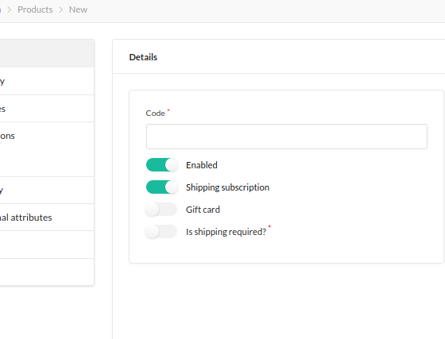
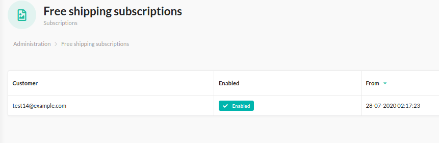
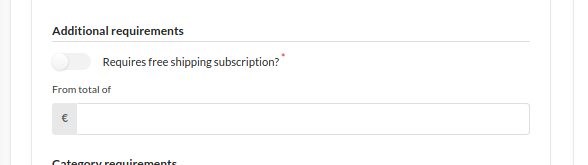

# [](https://bitbag.io/contact-us/?utm_source=github&utm_medium=referral&utm_campaign=plugins_shipping_subscription)

# BitBag SyliusShippingSubscriptionPlugin
----

At BitBag we do believe in open source. However, we are able to do it just because of our awesome clients, who are kind enough to share some parts of our work with the community. Therefore, if you feel like there is a possibility for us to work  together, feel free to reach out. You will find out more about our professional services, technologies, and contact details at [https://bitbag.io/](https://bitbag.io/contact-us/?utm_source=github&utm_medium=referral&utm_campaign=plugins_shipping_subscription).

Like what we do? Want to join us? Check out our job listings on our [career page](https://bitbag.io/career/?utm_source=github&utm_medium=referral&utm_campaign=career). Not familiar with Symfony & Sylius yet, but still want to start with us? Join our [academy](https://bitbag.io/pl/akademia?utm_source=github&utm_medium=url&utm_campaign=akademia)!

## Table of Content

***

* [Overview](#overview)
* [Support](#we-are-here-to-help)
* [Installation](#installation)
   * [Usage](#usage)
   * [Customization](#customization)
   * [Testing](#testing)
* [About us](#about-us)
   * [Community](#community)
* [Demo](#demo-sylius-shop)
* [License](#license)
* [Contact](#contact)

# Overview
----
This plugin allows you to enable free shipping subscription.


## We are here to help
This **open-source plugin was developed to help the Sylius community**. If you have any additional questions, would like help with installing or configuring the plugin, or need any assistance with your Sylius project - let us know!

[](https://bitbag.io/contact-us/?utm_source=github&utm_medium=referral&utm_campaign=plugins_shipping_subscription)

# Installation
----


We work on stable, supported and up-to-date versions of packages. We recommend you to do the same.
```bash
$ composer require bitbag/shipping-subscription-plugin
```

Add plugin dependencies to your `config/bundles.php` file:
```php
return [
    ...

    BitBag\SyliusShippingSubscriptionPlugin\BitBagSyliusShippingSubscriptionPlugin::class => ['all' => true],
];
```
Import required config in your `config/packages/_sylius.yaml` file:

```yaml
# config/packages/_sylius.yaml
    
imports: 
    ...

    - { resource: "@BitBagSyliusShippingSubscriptionPlugin/Resources/config/services.xml" }
    - { resource: "@BitBagSyliusShippingSubscriptionPlugin/Resources/config/resources.yml" }
    - { resource: "@BitBagSyliusShippingSubscriptionPlugin/Resources/config/grids.yml" }
```    

Add routing in your `config/routes.yaml` file:

```yaml
    
# config/routes.yaml
...
    
bitbag_sylius_shipping_subscription_plugin:
    resource: "@BitBagSyliusShippingSubscriptionPlugin/Resources/config/routing.yml"
```

Extend `Product`(including Doctrine mapping):

```php
<?php 

declare(strict_types=1);
   
namespace App\Entity\Product;
   
use BitBag\SyliusShippingSubscriptionPlugin\Entity\ProductShippingSubscriptionAwareInterface;
use BitBag\SyliusShippingSubscriptionPlugin\Entity\ProductTrait as SubscriptionShippingProductTrait;
use Sylius\Component\Core\Model\Product as BaseProduct;
   
class Product extends BaseProduct implements ProductShippingSubscriptionAwareInterface
{
    use SubscriptionShippingProductTrait;
}
```

   Mapping (XML):

```xml
<?xml version="1.0" encoding="UTF-8"?>

<doctrine-mapping
    xmlns="http://doctrine-project.org/schemas/orm/doctrine-mapping"
    xmlns:xsi="http://www.w3.org/2001/XMLSchema-instance"
    xsi:schemaLocation="http://doctrine-project.org/schemas/orm/doctrine-mapping
                            http://doctrine-project.org/schemas/orm/doctrine-mapping.xsd"
>
   <entity name="App\Entity\Product\Product" table="sylius_product">
      <field name="shippingSubscription" type="boolean">
         <options>
            <option name="default">0</option>
         </options>
      </field>
   </entity>
</doctrine-mapping>
   ```
Extend `Customer` (including Doctrine mapping):

```php
<?php
    
declare(strict_types=1);
    
namespace App\Entity\Customer;

use BitBag\SyliusShippingSubscriptionPlugin\Entity\ShippingSubscriptionInterface;    
use BitBag\SyliusShippingSubscriptionPlugin\Entity\SubscriptionAwareInterface;
use Doctrine\Common\Collections\Collection;
use Sylius\Component\Core\Model\Customer as BaseCustomer;
    
class Customer extends BaseCustomer implements SubscriptionAwareInterface
{
    /** @var Collection<int, ShippingSubscriptionInterface>|null */
    protected $shippingSubscriptions;

    /** @return Collection<int, ShippingSubscriptionInterface>|null */
    public function getSubscriptions(): ?Collection
    {
        return $this->shippingSubscriptions;
    }
}
```

   Mapping (XML):

```xml
<?xml version="1.0" encoding="UTF-8"?>

<doctrine-mapping
    xmlns="http://doctrine-project.org/schemas/orm/doctrine-mapping"
    xmlns:xsi="http://www.w3.org/2001/XMLSchema-instance"
    xsi:schemaLocation="http://doctrine-project.org/schemas/orm/doctrine-mapping
                            http://doctrine-project.org/schemas/orm/doctrine-mapping.xsd"
>
   <entity name="App\Entity\Customer\Customer" table="sylius_customer">
      <one-to-many field="shippingSubscriptions" target-entity="BitBag\SyliusShippingSubscriptionPlugin\Entity\ShippingSubscription" mapped-by="customer" orphan-removal="true">
      </one-to-many>
   </entity>
</doctrine-mapping>
```

Extend `ShippingMethod` (including Doctrine mapping):

```php
<?php
    
declare(strict_types=1);
    
namespace App\Entity\Shipping;
    
use BitBag\SyliusShippingSubscriptionPlugin\Entity\ShippingSubscriptionMethodInterface;
use Sylius\Component\Core\Model\ShippingMethod as BaseShippingMethod;
    
class ShippingMethod extends BaseShippingMethod implements ShippingSubscriptionMethodInterface
{
    /** @var bool|null */
    protected $shippingSubscription;

    /** @var int|null */
    protected $availableFromTotal;

    public function getAvailableFromTotal(): ?int
    {
        return $this->availableFromTotal;
    }

    public function setAvailableFromTotal(?int $availableFromTotal): void
    {
        $this->availableFromTotal = $availableFromTotal;
    }

    public function isShippingSubscription(): ?bool
    {
        return $this->shippingSubscription;
    }

    public function setShippingSubscription(?bool $shippingSubscription): void
    {
        $this->shippingSubscription = $shippingSubscription;
    }
}
```
   Mapping (XML):

```xml

<?xml version="1.0" encoding="UTF-8"?>

<doctrine-mapping
    xmlns="http://doctrine-project.org/schemas/orm/doctrine-mapping"
    xmlns:xsi="http://www.w3.org/2001/XMLSchema-instance"
    xsi:schemaLocation="http://doctrine-project.org/schemas/orm/doctrine-mapping
                            http://doctrine-project.org/schemas/orm/doctrine-mapping.xsd"
>
    <entity name="App\Entity\Shipping\ShippingMethod" table="sylius_shipping_method">
        <field name="shippingSubscription" type="boolean" nullable="true">
            <options>
                <option name="default">0</option>
            </options>
        </field>
        <field name="availableFromTotal" type="integer" nullable="true">
        </field>
    </entity>
</doctrine-mapping>


```
Extend `ProductVariant`:

```php
<?php
    
declare(strict_types=1);
    
namespace App\Entity\Product;
    
use BitBag\SyliusShippingSubscriptionPlugin\Entity\ProductVariantInterface;
use Sylius\Component\Core\Model\ProductVariant as BaseProductVariant;

class ProductVariant extends BaseProductVariant implements ProductVariantInterface
{
    /** @var int|null */
    protected $subscriptionLength;

    public function getSubscriptionLength(): ?int
    {
        return $this->subscriptionLength;
    }

    public function setSubscriptionLength(?int $subscriptionLength): void
    {
        $this->subscriptionLength = $subscriptionLength;
    }
}
```

Mapping (XML):

```xml
<?xml version="1.0" encoding="UTF-8"?>

<doctrine-mapping
    xmlns="http://doctrine-project.org/schemas/orm/doctrine-mapping"
    xmlns:xsi="http://www.w3.org/2001/XMLSchema-instance"
    xsi:schemaLocation="http://doctrine-project.org/schemas/orm/doctrine-mapping
                            http://doctrine-project.org/schemas/orm/doctrine-mapping.xsd"
>
    <entity name="App\Entity\Product\ProductVariant" table="sylius_product_variant">
        <field name="subscriptionLength" type="integer" nullable="true">
            <options>
                <option name="default">0</option>
            </options>
        </field>
    </entity>
</doctrine-mapping>


```

Extend `OrderItemUnitRepository`:

```php
<?php
    
declare(strict_types=1);
    
namespace App\Repository;
    
use BitBag\SyliusShippingSubscriptionPlugin\Repository\ShippingSubscriptionOrderRepositoryAwareInterface;
use BitBag\SyliusShippingSubscriptionPlugin\Repository\ShippingSubscriptionOrderRepositoryTrait;
use Sylius\Bundle\CoreBundle\Doctrine\ORM\OrderItemUnitRepository as BaseOrderItemUnitRepository;
    
final class OrderItemUnitRepository extends BaseOrderItemUnitRepository implements ShippingSubscriptionOrderRepositoryAwareInterface
{
    use ShippingSubscriptionOrderRepositoryTrait;
}
```

Add configuration to `config/packages/_sylius.yaml`:

```yaml
sylius_product:
    resources:
        product:
            classes:
                model: App\Entity\Product\Product
        product_variant:
            classes:
                model: App\Entity\Product\ProductVariant
                   
sylius_shipping:
    resources:
        shipping_method:
            classes:
                model: App\Entity\Shipping\ShippingMethod
   
sylius_customer:
    resources:
        customer:
            classes:
                model: App\Entity\Customer\Customer
   
sylius_order:
    resources:
        order_item_unit:
            classes:
                repository: App\Repository\OrderItemUnitRepository
```

Override forms by creating `templates/bundles/SyliusAdminBundle/Product/Tab/_details.html.twig`:

```twig


<div class="ui active tab" data-tab="details">
    <h3 class="ui top attached header">{{ 'sylius.ui.details'|trans }}</h3>

    <div class="ui attached segment">
        {{ form_errors(form) }}

        <div class="ui two column stackable grid">
            <div class="column">
                <div class="ui segment">
                    {{ form_row(form.code) }}
                    {{ form_row(form.enabled) }}
                    {{ form_row(form.shippingSubscription) }}
                    
                        {{ form_row(form.variant.shippingRequired) }}
                    
                        {{ form_row(form.options) }}
                        {{ form_row(form.variantSelectionMethod) }}
                    

                    {# Nothing to see here. #}
                    <div class="ui hidden element">
                        
                            {{ form_row(form.variant.translations) }}
                            {{ form_row(form.variantSelectionMethod) }}
                        
                    </div>
                </div>
            </div>
            <div class="column">
                {{ form_row(form.channels) }}
            </div>
        </div>
        
            <div class="ui one column stackable grid">
                <div class="column">
                    <h4 class="ui dividing header">{{ 'sylius.ui.pricing'|trans }}</h4>
                    
                </div>
            </div>
        
        <div class="ui hidden divider"></div>
        {{ translationFormWithSlug(form.translations, '@SyliusAdmin/Product/_slugField.html.twig', product) }}
        
            <div class="ui hidden divider"></div>
            <div class="ui two column stackable grid">
                <div class="column">
                    <h4 class="ui top attached header">{{ 'sylius.ui.shipping'|trans }}</h4>
                    <div class="ui attached segment">
                        {{ form_row(form.variant.shippingCategory) }}
                        {{ form_row(form.variant.width) }}
                        {{ form_row(form.variant.height) }}
                        {{ form_row(form.variant.depth) }}
                        {{ form_row(form.variant.weight) }}
                    </div>
                </div>
                <div class="column">
                    <h4 class="ui top attached header">{{ 'sylius.ui.taxes'|trans }}</h4>
                    <div class="ui attached segment">
                        {{ form_row(form.variant.taxCategory) }}
                    </div>
                </div>
            </div>
        

        {{ sylius_template_event(['sylius.admin.product.' ~ action ~ '.tab_details', 'sylius.admin.product.tab_details'], {'form': form}) }}
    </div>
</div>
```

   `templates/bundles/SyliusAdminBundle/ShippingMethod/_form.html.twig`:

```twig


<div class="ui two column stackable grid">
    <div class="column">
        <div class="ui segment">
            {{ form_errors(form) }}
            <div class="three fields">
                {{ form_row(form.code) }}
                {{ form_row(form.zone) }}
                {{ form_row(form.position) }}
            </div>
            {{ form_row(form.enabled) }}
            <h4 class="ui dividing header">{{ 'sylius.ui.availability'|trans }}</h4>
            {{ form_row(form.channels) }}
            <h4 class="ui dividing header">{{ 'bitbag_sylius_shipping_subscription.form.shipping.additional_requirements'|trans }}</h4>
            {{ form_row(form.shipping_subscription) }}
            <div class="field">
            {{ form_row(form.availableFromTotal) }}
            </div>
            <h4 class="ui dividing header">{{ 'sylius.ui.category_requirements'|trans }}</h4>
            {{ form_row(form.category) }}
            
                {{ form_row(categoryRequirementChoiceForm) }}
            
            <h4 class="ui dividing header">{{ 'sylius.ui.taxes'|trans }}</h4>
            {{ form_row(form.taxCategory) }}
            <h4 class="ui dividing header">{{ 'sylius.ui.shipping_charges'|trans }}</h4>
            {{ form_row(form.calculator) }}
            
                <div id="{{ form.calculator.vars.id }}_{{ name }}" data-container=".configuration"
                     data-prototype="{{ form_widget(calculatorConfigurationPrototype)|e }}">
                </div>
            
            <div class="ui segment configuration">
                
                    
                        {{ form_row(field) }}
                    
                
            </div>

            <h4 class="ui dividing header">{{ 'sylius.ui.rules'|trans }}</h4>
            <div id="rules">
                
            </div>
        </div>
    </div>
    <div class="column">
        {{ translationForm(form.translations) }}
    </div>
</div>   
```

  `templates/bundles/SyliusAdminBundle/Product/ProductVariant/Tab/_details.html.twig`

```twig


<div class="ui active tab" data-tab="details">
    
        <h3 class="ui dividing header">{{ 'bitbag_sylius_shipping_subscription.form.shipping.subscription_time'|trans }}</h3>
        <div class="ui segment">
            {{ form_row(form.subscriptionLength) }}
        </div>
    
    <h3 class="ui dividing header">{{ 'sylius.ui.details'|trans }}</h3>
    <div class="ui segments">
        {{ translationForm(form.translations) }}
        <div class="ui hidden divider"></div>
        <div class="ui segment">
            {{ form_row(form.code) }}
            {{ form_row(form.enabled) }}
            <div class="two fields">
                {{ form_row(form.shippingCategory) }}
            </div>
            {{form_label(form.channelPricings)}}
            
        </div>
        <div class="ui segment">
            <div class="one field">
                {{ form_row(form.shippingRequired) }}
            </div>
        </div>
        
            <div class="ui hidden divider"></div>
            <div class="ui segment">
                <h4 class="ui dividing header">{{ 'sylius.ui.options'|trans }}</h4>
                
                    {{ form_row(option_form) }}
                
            </div>
        
        <div class="ui hidden divider"></div>
        <div class="ui segment">
            <h4 class="ui dividing header">{{ 'sylius.ui.properties'|trans }}</h4>
            {{ form_row(form.height) }}
            {{ form_row(form.width) }}
            {{ form_row(form.depth) }}
            {{ form_row(form.weight) }}
        </div>
    </div>

    {{ sylius_template_event(['sylius.admin.product_variant.' ~ action ~ '.tab_details', 'sylius.admin.product_variant.tab_details'], {'form': form}) }}
</div>

```

Add state machine configuration for example to `config/packages/state_machine.yaml`:

```yaml
winzou_state_machine:
    sylius_order:
        callbacks:
            after:
                bitbag_order_cancellation_shipping_subscription:
                    on: [ "cancel" ]
                    do: [ "@bitbag_sylius_shipping_subscription.operator.shipping_subscription", "disable" ]
                    args: [ "object" ]

    sylius_order_checkout:
        callbacks:
            after:
                bitbag_created_shipping_subscription:
                    on: [ "complete" ]
                    do: [ "@bitbag_sylius_shipping_subscription.operator.shipping_subscription", "create" ]
                    args: [ "object" ]

    sylius_order_payment:
        callbacks:
            after:
                bitbag_shipping_subscription_enable:
                    on: [ "pay" ]
                    do: [ "@bitbag_sylius_shipping_subscription.operator.shipping_subscription", "enable" ]
                    args: [ "object" ]
```

Finish the installation by updating the database schema and installing assets:

```
    $ bin/console doctrine:migrations:diff
    $ bin/console doctrine:migrations:migrate
```

## Usage
----

Create a virtual product which will be a subscription for free shipping.



Create a variant and specify the length of subscription


Once a user purchases a subscription and payment is confirmed, the subscription is activated.



You can then create a shipping method that will only be available to customers who have purchased a subscription.



## Customization
----

### Available services you can [decorate](https://symfony.com/doc/current/service_container/service_decoration.html) and forms you can [extend](http://symfony.com/doc/current/form/create_form_type_extension.html)

Run the below command to see what Symfony services are shared with this plugin:
```bash
$ bin/console debug:container | grep bitbag_sylius_shipping_subscription_plugin
```

## Testing
----

```bash
$ composer install
$ cd tests/Application
$ yarn install
$ yarn build
$ bin/console assets:install public -e test
$ bin/console doctrine:schema:create -e test
$ bin/console server:run 127.0.0.1:8080 -d public -e test
$ open http://localhost:8080
$ cd ../..
$ vendor/bin/phpspec run
```


# About us

---

BitBag is a company of people who **love what they do** and do it right. We fulfill the eCommerce technology stack with **Sylius**, Shopware, Akeneo, and Pimcore for PIM, eZ Platform for CMS, and VueStorefront for PWA. Our goal is to provide real digital transformation with an agile solution that scales with the **clients’ needs**. Our main area of expertise includes eCommerce consulting and development for B2C, B2B, and Multi-vendor Marketplaces.</br>
We are advisers in the first place. We start each project with a diagnosis of problems, and an analysis of the needs and **goals** that the client wants to achieve.</br>
We build **unforgettable**, consistent digital customer journeys on top of the **best technologies**. Based on a detailed analysis of the goals and needs of a given organization, we create dedicated systems and applications that let businesses grow.<br>
Our team is fluent in **Polish, English, German and, French**. That is why our cooperation with clients from all over the world is smooth.

**Some numbers from BitBag regarding Sylius:**
- 50+ **experts** including consultants, UI/UX designers, Sylius trained front-end and back-end developers,
- 120+ projects **delivered** on top of Sylius,
- 25+ **countries** of BitBag’s customers,
- 4+ **years** in the Sylius ecosystem.

**Our services:**
- Business audit/Consulting in the field of **strategy** development,
- Data/shop **migration**,
- Headless **eCommerce**,
- Personalized **software** development,
- **Project** maintenance and long term support,
- Technical **support**.

**Key clients:** Mollie, Guave, P24, Folkstar, i-LUNCH, Elvi Project, WestCoast Gifts.

---

If you need some help with Sylius development, don't be hesitated to contact us directly. You can fill the form on [this site](https://bitbag.io/contact-us/?utm_source=github&utm_medium=referral&utm_campaign=plugins_shipping_subscription) or send us an e-mail at hello@bitbag.io!

---

[](https://bitbag.io/contact-us/?utm_source=github&utm_medium=referral&utm_campaign=plugins_shipping_subscription)

## Community

---- 

For online communication, we invite you to chat with us & other users on [Sylius Slack](https://sylius-devs.slack.com/).

# Demo Sylius Shop

---

We created a demo app with some useful use-cases of plugins!
Visit [sylius-demo.bitbag.io](https://sylius-demo.bitbag.io/) to take a look at it. The admin can be accessed under
[sylius-demo.bitbag.io/admin/login](https://sylius-demo.bitbag.io/admin/login) link and `bitbag: bitbag` credentials.
Plugins that we have used in the demo:

| BitBag's Plugin | GitHub | Sylius' Store|
| ------ | ------ | ------|
| ACL Plugin | *Private. Available after the purchasing.*| https://plugins.sylius.com/plugin/access-control-layer-plugin/|
| Braintree Plugin | https://github.com/BitBagCommerce/SyliusBraintreePlugin |https://plugins.sylius.com/plugin/braintree-plugin/|
| CMS Plugin | https://github.com/BitBagCommerce/SyliusCmsPlugin | https://plugins.sylius.com/plugin/cmsplugin/|
| Elasticsearch Plugin | https://github.com/BitBagCommerce/SyliusElasticsearchPlugin | https://plugins.sylius.com/plugin/2004/|
| Mailchimp Plugin | https://github.com/BitBagCommerce/SyliusMailChimpPlugin | https://plugins.sylius.com/plugin/mailchimp/ |
| Multisafepay Plugin | https://github.com/BitBagCommerce/SyliusMultiSafepayPlugin |
| Wishlist Plugin | https://github.com/BitBagCommerce/SyliusWishlistPlugin | https://plugins.sylius.com/plugin/wishlist-plugin/|
| **Sylius' Plugin** | **GitHub** | **Sylius' Store** |
| Admin Order Creation Plugin | https://github.com/Sylius/AdminOrderCreationPlugin | https://plugins.sylius.com/plugin/admin-order-creation-plugin/ |
| Invoicing Plugin | https://github.com/Sylius/InvoicingPlugin | https://plugins.sylius.com/plugin/invoicing-plugin/ |
| Refund Plugin | https://github.com/Sylius/RefundPlugin | https://plugins.sylius.com/plugin/refund-plugin/ |

**If you need an overview of Sylius' capabilities, schedule a consultation with our expert.**

[](https://bitbag.io/contact-us/?utm_source=github&utm_medium=referral&utm_campaign=plugins_shipping_subscription)

## Additional resources for developers

---
To learn more about our contribution workflow and more, we encourage you to use the following resources:
* [Sylius Documentation](https://docs.sylius.com/en/latest/)
* [Sylius Contribution Guide](https://docs.sylius.com/en/latest/contributing/)
* [Sylius Online Course](https://sylius.com/online-course/)

## License

---

This plugin's source code is completely free and released under the terms of the MIT license.

[//]: # (These are reference links used in the body of this note and get stripped out when the markdown processor does its job. There is no need to format nicely because it shouldn't be seen.)

## Contact

---
If you want to contact us, the best way is to fill the form on [our website](https://bitbag.io/contact-us/?utm_source=github&utm_medium=referral&utm_campaign=plugins_shipping_subscription) or send us an e-mail to hello@bitbag.io with your question(s). We guarantee that we answer as soon as we can!

[](https://bitbag.io/contact-us/?utm_source=github&utm_medium=referral&utm_campaign=plugins_shipping_subscription)
