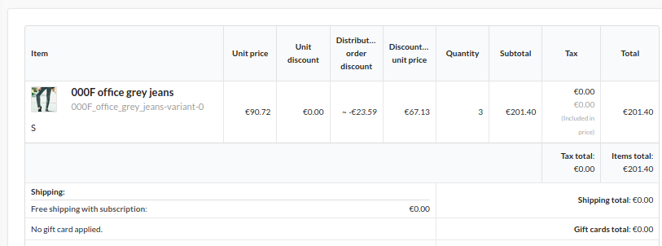

<h1 align="center">
    <a href="http://bitbag.shop" target="_blank">
        
    </a>
    <br />
    
</h1>

## About us

At BitBag we do believe in open source. However, we are able to do it just because of our awesome clients, who are kind enough to share some parts of our work with the community. Therefore, if you feel like there is a possibility for us working together, feel free to reach us out. You will find out more about our professional services, technologies and contact details at https://bitbag.io/.

## Screenshots




## Installation

1. Require plugin with composer:

    ```bash
    composer require bitbag/shipping-subscription-plugin
    ```
 
1. Add plugin dependencies to your `config/bundles.php` file:
    
    ```php
        return [
         ...
        
           BitBag\SyliusShippingSubscriptionPlugin\BitBagSyliusShippingSubscriptionPlugin::class => ['all' => true],
        ];
    ```

1. Import required config in your `config/packages/_sylius.yaml` file:
    
    ```yaml
    # config/packages/_sylius.yaml
    
    imports:
        ...
   
        - { resource: "@BitBagSyliusShippingSubscriptionPlugin/Resources/config/services.xml" }
        - { resource: "@BitBagSyliusShippingSubscriptionPlugin/Resources/config/resources.yml" }
        - { resource: "@BitBagSyliusShippingSubscriptionPlugin/Resources/config/grids.yml" }
    ```    

1. Add routing in your `config/routes/routes.yaml` file:
    
    ```yaml
    
    # config/routes/sylius_admin.yaml
    ...
    
    app_subscription:
        resource: |
            alias: bitbag.shipping_subscription
            section: admin
            templates: '@SyliusAdmin/Crud'
            except: ['show']
            grid: app_admin_subscription
        type: sylius.resource
        prefix: /admin

    ```

1. Extend `Product`(including Doctrine mapping):

    ```php
    <?php 
   
    declare(strict_types=1);
    
    namespace App\Entity\Product;
   
    use BitBag\SyliusShippingSubscriptionPlugin\Entity\ProductShippingSubscriptionAwareInterface;
    use BitBag\SyliusShippingSubscriptionPlugin\Entity\ProductTrait as SubscriptionShippingProductTrait;
    use Sylius\Component\Core\Model\Product as BaseProduct;
  

    class Product extends BaseProduct implements ProductShippingSubscriptionAwareInterface
    {
        use SubscriptionShippingProductTrait;  
    }
    ```
   
   Mapping (XML):
   
   ```xml
   <?xml version="1.0" encoding="UTF-8"?>
   <doctrine-mapping xmlns="http://doctrine-project.org/schemas/orm/doctrine-mapping"
                     xmlns:xsi="http://www.w3.org/2001/XMLSchema-instance"
                     xsi:schemaLocation="http://doctrine-project.org/schemas/orm/doctrine-mapping
                                         http://doctrine-project.org/schemas/orm/doctrine-mapping.xsd"
   >
       <entity name="App\Entity\Product\Product" table="sylius_product">
          <field name="shippingSubscription" type="boolean">
            <options>
                <option name="default">0</option>
            </options>
          </field>
       </entity>
   </doctrine-mapping>
   ```
   
1. Finish the installation by updating the database schema and installing assets:

    ```
    $ bin/console doctrine:migrations:diff
    $ bin/console doctrine:migrations:migrate
   ```
