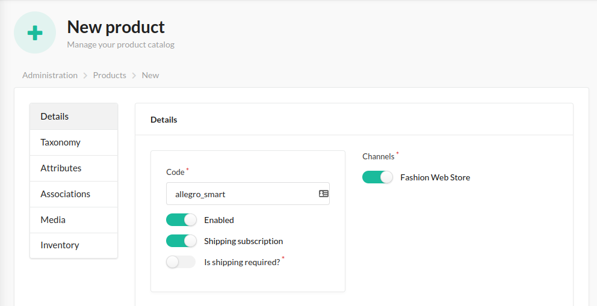
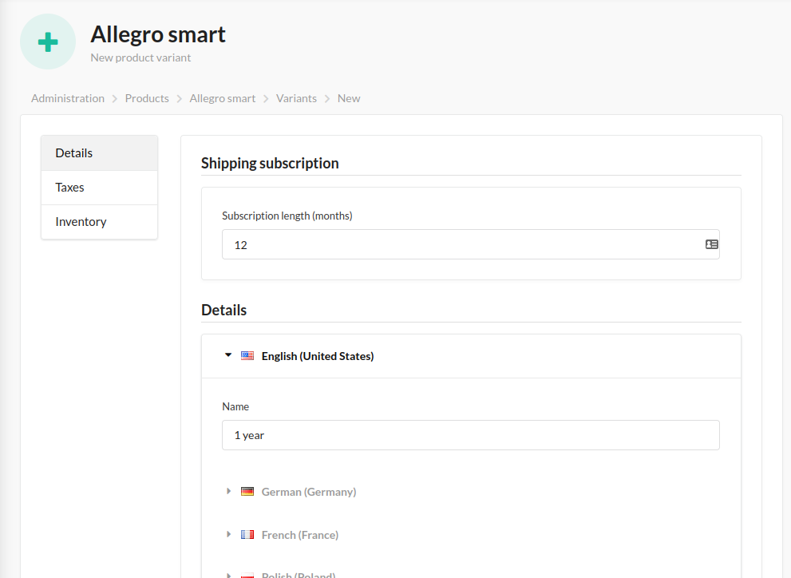
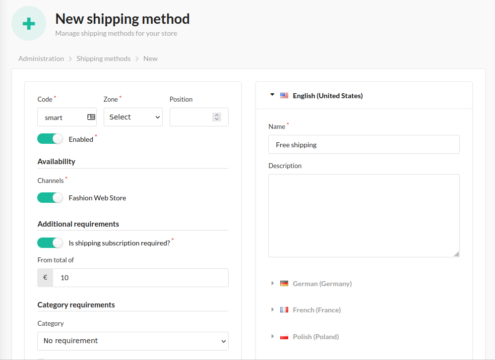
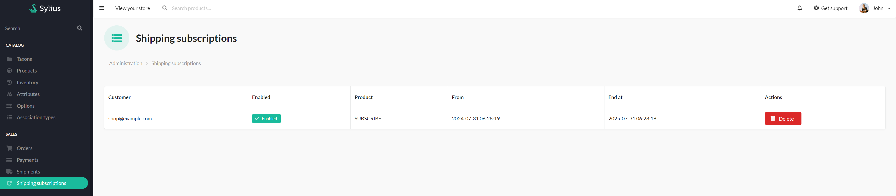

# Functionalities

---
## Introduction

---
Each of us as a customer likes to receive discounts and use promotions.
However, we mostly use the free shipping option. Adding anything to your cart to keep your shipment free.
Do you know it?

Sylius shipping subscription plugin offers functionality that allows you to enable free shipping to customers who have purchased a subscription.

## Usage

---
The plugin works by creating a product that corresponds to a specific subscription.
The purchase and payment of this item by the customer is equivalent to purchasing a subscription for free shipping.

Then you need to link the subscription to the shipping method and set the minimum order value from which the promotion will apply.

The plugin allows you to specify the price of the subscription and its duration.

### Adding Shipping Subscription as a product
#### Create a product
To enable the purchase of a subscription for free shipping you have to create a product. Mark this product as
a shipping subscription and save.

    

 

#### Create a variant and set the duration
Once the product is saved, create a variant and set the duration of the subscription (in months).

    

 

#### Create a shipping method
Now customers can purchase a subscription for free shipping.
But now you need to create a new shipping method. Set “Is shipping subscription required?” to on.
Then, type the minimal amount of order from which free shipping will be possible.

    

 

#### Shipping Subscription list
Once a user purchases a subscription and payment is confirmed, the subscription is activated.
You can check the list of subscriptions in the Shipping subscriptions menu.

    

 
